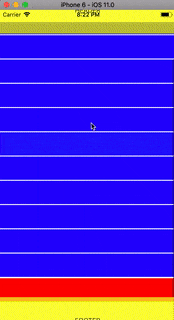
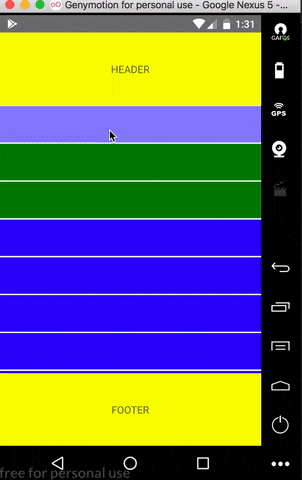

# react-native-awesome-list
[](https://npmjs.org/package/react-native-awesome-list "View this project on npm")
[](https://npmjs.org/package/react-native-awesome-list "View this project on npm")

React Native animated list with groups and subgroups



## Installation
1. `npm install react-native-awesome-list --save`
2. `react-native link react-native-awesome-list`

# Usage
```
import AwesomeList from 'react-native-awesome-list'
...
render() {
    let data = [
      {
        id: Math.random(),
        type: 'group',
        items: [{
          id: Math.random(),
          type: 'subgroup',
          items: [{id: Math.random()}, {id: Math.random()}]
        }, {
          id: Math.random(),
          type: 'subgroup',
          items: [{id: Math.random()}, {id: Math.random()}]
        }]
      },
      {
        id: Math.random(),
        type: 'group',
        items: [{id: Math.random()}, {id: Math.random()}]
      },
      {
        id: Math.random(),
      },
    ]
    return (
      <AwesomeList
        data={data}
        renderItem={this.renderItem}
        renderGroup={this.renderGroup}
        renderSubGroup={this.renderSubGroup}
        renderAnimatingHeader={()=> this.renderAnimatingHeader('HEADER')}
        renderAnimatingFooter={()=> this.renderAnimatingHeader('FOOTER')}
      />
    );
  }

  renderAnimatingHeader(title){
    return (
      <View style={{flex: 1, backgroundColor: 'yellow', justifyContent: 'center', alignItems: 'center'}}>
        <Text>{title}</Text>
      </View>
    );
  }

  renderItem(row){
    return (
      <View style={{backgroundColor: 'red', height: 50, marginVertical: 1}}/>
    );
  }

  renderGroup(){
    return (
      <View style={{backgroundColor: 'blue', height: 50, marginVertical: 1}}/>
    );
  }
  
  renderSubGroup(){
    return (
      <View style={{backgroundColor: 'green', height: 50, marginVertical: 1}}/>
    );
  }
...
```
## Props

| Prop  | Default  | Type | Description |
| :------------ |:---------------:| :---------------:| :-----|
| data | undefined | `array` | data for list |
| contentContainerStyle | undefined | `style` | root scrollview style |
| any FlatList props | undefined | `props` | you can provide FlatList props like ItemSeparatorComponent etc. |
| renderItem | undefined | `func` | render function for list item rendering |
| renderGroup | undefined | `func` | render function for list group rendering |
| renderSubGroup | undefined | `func` | render function for list subgroup rendering |
| toggleGroup | func | `func` | return index of clicked group and is group expanded bool|
| toggleSubGroup | func | `func` | return id of clicked subgroup and is subgroup expanded bool |
| headerHeight | 100 | `number` | header height |
| renderAnimatingHeader | undefined | `func` | render function for list animated header rendering |
| renderAnimatingFooter | undefined | `func` | render function for list animated footer rendering |
| disableScaleAnimation | false | `bool` | disabling scale animation while scroll |
| disableOpacityAnimation | false | `bool` | disabling opacity animation while scroll |


## Enjoy

## Questions or suggestions?

Feel free to [open an issue](https://github.com/ArtemKosiakevych/react-native-awesome-list/issues)


