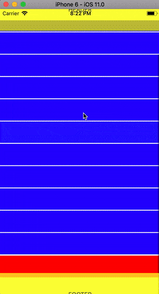

# react-native-awesome-list

React Native animated list with groups and subgroups

## Installation
1. `npm install react-native-awesome-list --save`
2. `react-native link react-native-awesome-list`

# Usage

## Props

| Prop  | Default  | Type | Description |
| :------------ |:---------------:| :---------------:| :-----|
| data | null | `array` | data for list |

